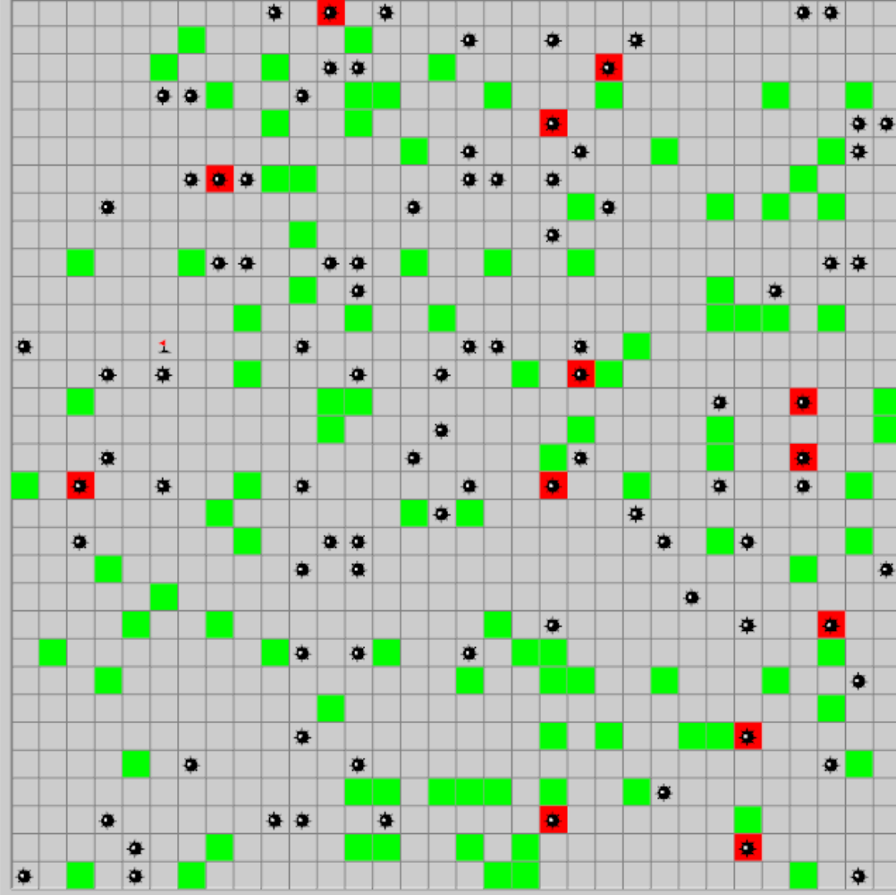

# Reinforcement-learning-in-Cuda
Multi-Agent Reinforcement Learning on CUDA  and Actor Critic (A2C) algorithm for final project. The environment of this project is shown below.

## Part 1
Multi-Agent Reinforcement Learning on CUDA. In this project, we use cuda to update the agent based on Q value. This is an extension of single agent case, which means multiple agents update in parallel.
## Part 2
Final Project focus on the further extension, which is the  Actor Critic (A2C) algorithm. The major part is similar as before, but we estimate value function and policy with 2 neural networks.

